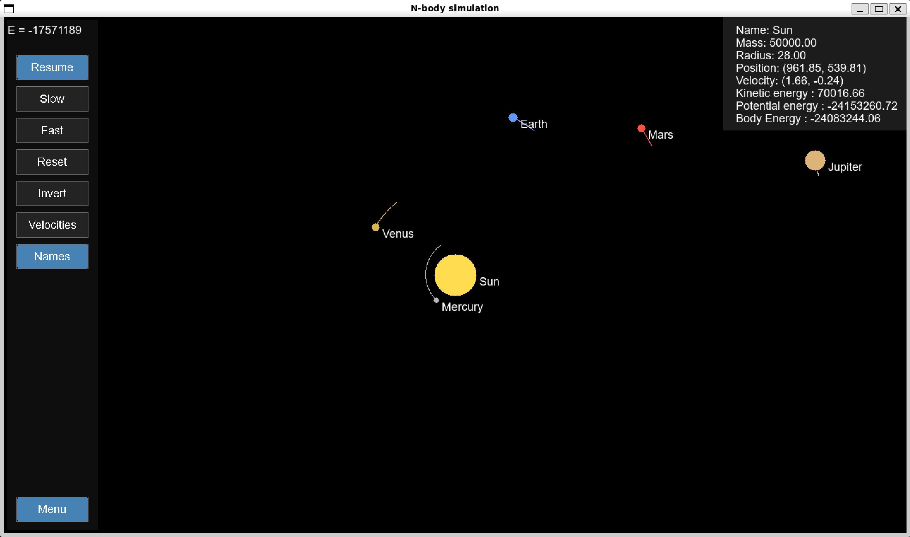

# Interactive 2D N-Body Planetary Simulator
Developped by AMELIN Zacharie and LE COTTY Tristan

This project is an interactive 2D gravitational simulator written in C using SDL2. It can simulate entire planetary systems, showcase orbital dynamics and display information about each body involved in the simulation. It also allows the user to add new bodies while the simulation is running, or delete already existing ones.



---

## Code Architecture

The project code is split into different files with different purposes. Each C module file has its corresponding header file.

| File | Responsibility |
|---|---|
| `main.c` | Main loop, event handling, camera, UI logic |
| `physics.c` | Gravitational force, collision detection, energy calculations |
| `leapfrog.c` | Numerical integration (leapfrog method) |
| `rendering.c` | SDL2 rendering: bodies, trails, buttons, HUD, arrows |
| `physics.h` | Body struct definition, physics function declarations |
| `rendering.h` | Rendering constants, Trail struct, rendering function declarations |
| `leapfrog.h` | Leapfrog function declaration |
| `Makefile` | Makefile for the project. Use is explained later in the README |
| `arial.ttf` | TTF file for the Arial font |
| `*.in` | Preset input files to run the program |

---

## Physics Model

### Gravitational Attraction
Each pair of bodies exerts a force on one another following Newton's attraction law:

```
F = G * m1 * m2 / r²
```

where `G` is the gravitational constant, `m1` and `m2` are the masses, and `r` is the distance between the two bodies.

### Collision Handling
When two bodies collide (as soon as they touch each other), they merge into a single body. The resulting body conserves:
- **Mass**: sum of both masses
- **Momentum**: `p = m1*v1 + m2*v2`
- **Volume**: sum of both volumes

### Simplifications
- All motion is strictly 2D
- Units are arbitrary (not astronomical units), and `G` is set to `50`
- No relativistic effects
- Fixed timestep for integration

---

## Numerical Integration: Leapfrog

The equations of motion are integrated using the Velocity Verlet (leapfrog) method. Each timestep proceeds in four stages. First, the gravitational acceleration a(t) is computed for every body from the current positions. Second, each velocity is advanced by a half-step: v(t + dt/2) = v(t) + a(t) * dt/2. Third, positions are updated using this half-step velocity: x(t + dt) = x(t) + v(t + dt/2) * dt. Fourth, the acceleration is recomputed at the new positions a(t + dt), and the velocity is advanced by a second half-step: v(t + dt) = v(t + dt/2) + a(t + dt) * dt/2. 
This two-stage velocity update is what distinguishes the leapfrog from a simple Euler method: it is a second-order symplectic integrator, meaning it conserves the total energy of the system over long timescales far better than the Euler method, which makes it particularly well suited for simulating stable orbits.

---

## Prerequisites

### Dependencies
- `gcc`
- `SDL2`
- `SDL2_ttf`
- `make`

### Installation of SDL2
```bash
sudo apt install gcc make libsdl2-dev libsdl2-ttf-dev
```

---

## Compile and Run the simulation

### Compile
```bash
make
```

### Clean and recompile
```bash
make re
```

### Run
```bash
./program < input_file.txt
```

### Example
```bash
./program < solar_system.in
```

---

## Input File Format

The input file is a plain-text file with the following structure:

```
N
id mass radius x y vx vy type r g b name
id mass radius x y vx vy type r g b name
...
```

### Fields

| Field | Type | Description |
|---|---|---|
| `N` | int | Number of bodies |
| `id` | int | Unique identifier |
| `mass` | double | Mass of the body |
| `radius` | double | Radius (for display and collision) |
| `x`, `y` | double | Initial position |
| `vx`, `vy` | double | Initial velocity |
| `type` | int | `1` = active, `0` = inactive |
| `r`, `g`, `b` | int | RGB color (0–255) |
| `name` | string | Name of the body (no spaces) |

### Example: Earth-Moon System

```
2
1 1000.0 20.0 600.0 400.0 0.0 0.0 1 245 142 39 Earth
2 1.0 5.0 600.0 200.0 10.0 0.0 1 128 91 56 Moon
```

---

## Controls

The simulation can be controlled entirely from the keyboard and mouse. The controls are as follows.

### Keyboard

| Key | Action |
|---|---|
| `P` | Pause / Resume |
| `F` | Speed up |
| `S` | Slow down |
| `R` | Reset simulation |
| `←` | Invert time (run backwards) |
| `→` | Run forwards |
| `↑` | Zoom in (on the center of the screen)|
| `↓` | Zoom out |
| `Esc` | Quit the simulation / Cancel body creation |
| `Suppr` | Delete selected body |

### Mouse

| Action | Effect |
|---|---|
| Left click on a body | Follow the body with the camera |
| Left click + drag | Pan the camera |
| Scroll wheel | Zoom in / out on the position of the cursor |
| Right click + drag | Set position and velocity of a new body |
| Release right click | Open mass/radius input form for the new body|

### Body Creation Form

| Key | Action |
|---|---|
| `Tab` | Switch between Mass and Radius fields |
| `Backspace` | Clear current field |
| `Enter` | Confirm and add the body |
| `Esc` | Cancel the creation and return to simulation |

### Buttons

| Button | Action |
|---|---|
| Menu | Toggle the display of the buttons |
| Pause | Pause / Resume |
| Slow | Halve simulation speed |
| Fast | Double simulation speed |
| Reset | Reset to initial state |
| Invert | Invert time direction |
| Velocities | Toggle velocity vectors |
| Names | Toggle body name labels |

---

## Limitations of this simulator

Performance profiling was carried out using gprof. 
The results showed that `render_trail` accounts for over 80% of total CPU time, being called once per body every frame and drawing up to `TRAIL_LEN = 300` line segments each time. A simple optimization would be to reduce TRAIL_LEN in rendering.h, or to skip every other point in the trail loop. This optimisation has not been carried out as we have only used this simulator for a restricted amount of bodies, and it was running smoothly. The gravitational force computation in `simulate_grav_forceN` runs in O(N²) every `dt` timestep, which would become an issue when simulating systems with large amounts of bodies.

Other limitations and possible future improvements : 
- The `type` of the bodies isn't use other than to differentiate "active" bodies from "inactive" (bodies that actually don't exist anymore). Future work could include differentiating stars, planets, asteroids,...
- Bodies that travel beyond coordinate ±10,000,000 are automatically deactivated to prevent an integer overflow (this number could be increased if wanted, as soon as it stays inferior the the maximum integer in C)
- The maximum number of bodies is capped at `MAX_BODIES = 256`. It can be increased by modifying the value of `MAX_BODIES` in `rendering.h`
- New bodies added during the simulation are not saved on reset (only the initial configuration is restored). It could be interesting to add a `save` function, to save the current simulation into a file using the same format as the input files.
- Making the simulation run back in time will not undo the merging of two bodies.